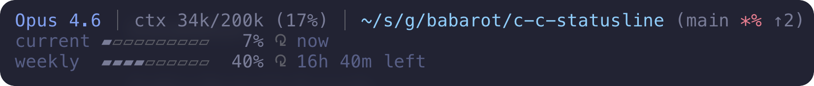

# c-c-statusline

A Deno-powered status line for Claude Code CLI.

Shows model info, context usage, rate limits, git status, session duration, and more — right in your terminal.



## Install

Downloads a precompiled binary from GitHub Releases. No runtime dependencies needed.

```bash
# curl
curl -fsSL https://raw.githubusercontent.com/babarot/c-c-statusline/main/bin/install.sh | bash

# npx
npx @babarot/c-c-statusline

# Deno
deno run -A https://raw.githubusercontent.com/babarot/c-c-statusline/main/bin/install.ts
```

## Configure

### Config file (recommended)

Generate `~/.claude/statusline.yaml` with defaults:

```bash
# After install
~/.claude/c-c-statusline --init-config

# Or during install
curl -fsSL https://raw.githubusercontent.com/babarot/c-c-statusline/main/bin/install.sh \
  | bash -s -- --init-config
```

Then edit to your liking:

```yaml
options:
  bar-style: block
  path-style: short
  theme: tokyo-night-storm
  time-style: relative
  ctx-format: 'ctx {used}/{total} ({pct}%)'
  git-symbols:
    stash: "-"
    untracked: "?"
```

### CLI flags

CLI flags override config file values. Useful for quick testing or one-off overrides.

```bash
# Pass flags during install to set defaults in settings.json
curl -fsSL https://raw.githubusercontent.com/babarot/c-c-statusline/main/bin/install.sh \
  | bash -s -- --bar-style block --path-style short --theme tokyo-night
```

## Options

| Option | Values | Default | Description |
|---|---|---|---|
| `bar-style` | `dot`, `block`, `fill` | `dot` | Progress bar style |
| `path-style` | `parent`, `full`, `short`, `basename` | `parent` | Directory display style |
| `theme` | See [Themes](#themes) | `default` | Color theme |
| `time-style` | `absolute`, `relative` | `absolute` | Reset time format |
| `ctx-format` | Format string | `ctx {used}/{total} ({pct}%)` | Context display format |
| `git-symbols` | Map or `key=val,...` | See [below](#git-symbols) | Override git status symbols |

### bar-style

| Value | Output |
|---|---|
| `dot` | `●●●●○○○○○○` |
| `block` | `▰▰▰▰▱▱▱▱▱▱` |
| `fill` | `████░░░░░░` |

### path-style

For `/Users/you/src/github.com/you/project`:

| Value | Output |
|---|---|
| `parent` | `you/project` |
| `full` | `~/src/github.com/you/project` |
| `short` | `~/s/g/you/project` |
| `basename` | `project` |

### time-style

| Value | Output |
|---|---|
| `absolute` | `8:00pm`, `Mar 12, 2:00pm` |
| `relative` | `1h 30m left`, `2d 5h left` |

### ctx-format

Use `{used}`, `{total}`, `{pct}` placeholders.

| Value | Output |
|---|---|
| `ctx {used}/{total} ({pct}%)` | `ctx 28k/200k (14%)` |
| `{pct}% ({used}/{total})` | `14% (28k/200k)` |
| `{pct}%` | `14%` |
| `{used} of {total}` | `28k of 200k` |

### Themes

Built-in color themes using 24-bit True Color (RGB). Each theme defines 8 semantic color roles (`primary`, `secondary`, `success`, `warning`, `caution`, `danger`, `muted`, `accent`).

| Theme | Description |
|---|---|
| `default` | Original palette |
| `tokyo-night` | [Tokyo Night](https://github.com/enkia/tokyo-night-vscode-theme) Dark |
| `tokyo-night-storm` | Tokyo Night Storm |
| `tokyo-night-light` | Tokyo Night Light |
| `catppuccin-mocha` | [Catppuccin](https://github.com/catppuccin/catppuccin) Mocha |
| `dracula` | [Dracula](https://draculatheme.com/) |
| `solarized-dark` | [Solarized](https://ethanschoonover.com/solarized/) Dark |
| `gruvbox-dark` | [Gruvbox](https://github.com/morhetz/gruvbox) Dark |
| `nord` | [Nord](https://www.nordtheme.com/) |
| `one-dark` | [One Dark](https://github.com/Binaryify/OneDark-Pro) |
| `github-dark` | [GitHub Dark](https://github.com/primer/primitives) |
| `kanagawa` | [Kanagawa](https://github.com/rebelot/kanagawa.nvim) |
| `rose-pine` | [Rosé Pine](https://rosepinetheme.com/) |

### Git symbols

Override any git status symbol. In the config file, use a map; with CLI flags, use `key=val,...` format.

| Key | Default | Description |
|---|---|---|
| `unstaged` | `*` | Unstaged changes |
| `staged` | `+` | Staged changes |
| `stash` | `$` | Stash entries exist |
| `untracked` | `%` | Untracked files |
| `ahead` | `↑` | Ahead of upstream |
| `behind` | `↓` | Behind upstream |

Config file:
```yaml
options:
  git-symbols:
    stash: "-"
    untracked: "?"
```

CLI flag:
```bash
--git-symbols "stash=-,untracked=?"
```

## What it shows

**Line 1:** Model name, context usage (tokens + %), directory, git status, session duration, effort level

**Lines 2+:** Rate limit usage (current 5-hour window, weekly, extra credits when active)

### Git status

Inspired by [git-prompt.sh](https://github.com/git/git/blob/master/contrib/completion/git-prompt.sh). Displays branch name and rich status indicators:

```
(main *+$% ↑1↓2|REBASE 3/5)
```

| Symbol | Meaning |
|---|---|
| `*` | Unstaged changes |
| `+` | Staged changes |
| `$` | Stash entries exist |
| `%` | Untracked files |
| `↑N` | N commits ahead of upstream |
| `↓N` | N commits behind upstream |
| `\|REBASE` | Rebase in progress (with step/total) |
| `\|MERGING` | Merge in progress |
| `\|CHERRY-PICKING` | Cherry-pick in progress |
| `\|REVERTING` | Revert in progress |
| `\|BISECTING` | Bisect in progress |
| `\|AM` | `git am` in progress |

Detached HEAD is shown in red with a tag or short SHA.

## Uninstall

```bash
# curl
curl -fsSL https://raw.githubusercontent.com/babarot/c-c-statusline/main/bin/install.sh | bash -s -- --uninstall

# npx
npx @babarot/c-c-statusline --uninstall

# Deno
deno run -A https://raw.githubusercontent.com/babarot/c-c-statusline/main/bin/install.ts --uninstall
```

## License

MIT
