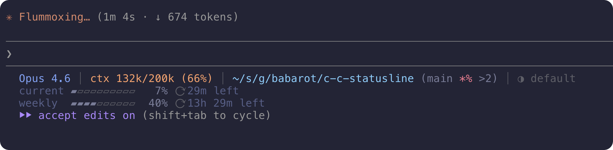

# c-c-statusline

[](https://github.com/babarot/c-c-statusline/actions/workflows/test.yml)

A Deno-powered status line for Claude Code CLI.

Shows model info, context usage, rate limits, git status, session duration, and more — right in your terminal.



## Install

Downloads a precompiled binary from GitHub Releases. No runtime dependencies needed.

```bash
# curl
curl -fsSL https://raw.githubusercontent.com/babarot/c-c-statusline/main/bin/install.sh | bash

# npx
npx @babarot/c-c-statusline

# deno
deno run -A https://raw.githubusercontent.com/babarot/c-c-statusline/main/bin/install.ts
```

### Build from source

Requires [Deno](https://deno.land/).

```bash
git clone https://github.com/babarot/c-c-statusline.git
cd c-c-statusline
make install
```

This compiles the binary and installs it to `~/.claude/c-c-statusline`.

## Configure

### Config file (recommended)

Generate `~/.claude/statusline.yaml` with defaults:

```bash
# After install
~/.claude/c-c-statusline --init-config
```

Or during install:

```bash
# curl
curl -fsSL https://raw.githubusercontent.com/babarot/c-c-statusline/main/bin/install.sh | bash -s -- --init-config

# npx
npx @babarot/c-c-statusline --init-config

# deno
deno run -A https://raw.githubusercontent.com/babarot/c-c-statusline/main/bin/install.ts --init-config
```

Then edit to your liking:

```yaml
# ~/.claude/statusline.yaml
theme: tokyo-night-storm

# Layout: controls which items appear on each line and their order.
# Items not listed here are hidden. Remove an item to hide it.
lines:
  - [model, context, git, duration, effort, vim, update]
  - [usage]

# Per-item options
items:
  context:
    format: 'ctx {used}/{total} ({pct}%)'
  git:
    path-style: short
    # symbols:
    #   stash: "-"
    #   untracked: "?"
  vim:
    mode: auto
  usage:
    bar-style: block
    time-style: relative
```

`settings.json` stays clean — no flags in the command:

```jsonc
// ~/.claude/settings.json
{
  "statusLine": {
    "type": "command",
    "command": "\"$HOME/.claude/c-c-statusline\""
  }
}
```

### CLI flags

CLI flags override config file values. Pass flags during install to bake them into `settings.json`:

```bash
# curl
curl -fsSL https://raw.githubusercontent.com/babarot/c-c-statusline/main/bin/install.sh \
  | bash -s -- --bar-style block --path-style short --theme tokyo-night

# npx
npx @babarot/c-c-statusline --bar-style block --path-style short --theme tokyo-night

# deno
deno run -A https://raw.githubusercontent.com/babarot/c-c-statusline/main/bin/install.ts \
  --bar-style block --path-style short --theme tokyo-night
```

This writes the flags directly into the command:

```jsonc
// ~/.claude/settings.json
{
  "statusLine": {
    "type": "command",
    "command": "\"$HOME/.claude/c-c-statusline\" --bar-style block --path-style short --theme tokyo-night"
  }
}
```

## Layout

The `lines` config controls which items appear and in what order. Each array is a display line:

```yaml
lines:
  - [model, context, git, duration, effort, vim, update]  # line 1
  - [usage]                                                 # line 2+
```

**Available items:** `model`, `context`, `git`, `duration`, `effort`, `vim`, `update`, `usage`

- Items are rendered left-to-right within each line, separated by `│`
- Remove an item from `lines` to hide it
- Reorder items to change display order
- If `lines` is omitted, the default layout above is used

Examples:

```yaml
# Minimal: only git and usage
lines:
  - [git, effort]
  - [usage]

# Everything on one line (no rate limit bars)
lines:
  - [model, context, git, duration, effort, vim, update, usage]

# Custom order
lines:
  - [git, context, model]
  - [usage]
```

## Options

Options are organized per-item under the `items` section, plus a global `theme`:

| Scope | Option | Values | Default | Description |
|---|---|---|---|---|
| global | `theme` | See [Themes](#themes) | `default` | Color theme |
| `items.usage` | `bar-style` | `dot`, `block`, `fill` | `dot` | Progress bar style |
| `items.usage` | `time-style` | `absolute`, `relative` | `absolute` | Reset time format |
| `items.git` | `path-style` | `parent`, `full`, `short`, `basename` | `parent` | Directory display style |
| `items.git` | `symbols` | Map | See [below](#git-symbols) | Override git status symbols |
| `items.git` | `link` | Map | See [below](#branch-link) | Make branch name a clickable link (OSC 8) |
| `items.context` | `format` | Format string | `ctx {used}/{total} ({pct}%)` | Context display format |
| `items.vim` | `mode` | `auto`, `always` | `auto` | Vim mode indicator behavior |

> **Legacy support:** The flat `options` format (e.g. `options.bar-style`) still works for backward compatibility. CLI flags (e.g. `--bar-style`) also continue to work and override config file values.

### bar-style

| Input | Output |
|---|---|
| `--bar-style dot` | `●●●●○○○○○○` |
| `--bar-style block` | `▰▰▰▰▱▱▱▱▱▱` |
| `--bar-style fill` | `████░░░░░░` |

### path-style

For `/Users/you/src/github.com/you/project`:

| Input | Output |
|---|---|
| `--path-style parent` | `you/project` |
| `--path-style full` | `~/src/github.com/you/project` |
| `--path-style short` | `~/s/g/you/project` |
| `--path-style basename` | `project` |

### time-style

| Input | Output |
|---|---|
| `--time-style absolute` | `8:00pm`, `Mar 12, 2:00pm` |
| `--time-style relative` | `1h 30m left`, `2d 5h left` |

### ctx-format

Use `{used}`, `{total}`, `{pct}`, `{compact}` placeholders.

| Placeholder | Description |
|---|---|
| `{used}` | Tokens used (e.g. `28k`) |
| `{total}` | Context window size (e.g. `200k`) |
| `{pct}` | Usage percentage (e.g. `14`) |
| `{compact}` | Remaining % until auto-compact (based on 80% usable threshold) |

| Input | Output |
|---|---|
| `--ctx-format 'ctx {used}/{total} ({pct}%)'` | `ctx 28k/200k (14%)` |
| `--ctx-format '{pct}% ({used}/{total})'` | `14% (28k/200k)` |
| `--ctx-format '{pct}% compact:{compact}%'` | `14% compact:83%` |
| `--ctx-format '{used} of {total}'` | `28k of 200k` |

### model-name

To hide the model name, remove `model` from `lines`:

```yaml
lines:
  - [context, git, duration, effort, vim, update]  # no "model"
  - [usage]
```

> Legacy: `--model-name off` and `options.model-name: "off"` still work.

### vim-mode

Shows the current Vim mode when Claude Code's Vim keybinding is enabled.

| Value | Behavior |
|---|---|
| `auto` | Show only in `NORMAL` mode (hides in `INSERT` to reduce noise) |
| `always` | Show in all modes (`NORMAL`, `INSERT`, etc.) |

To hide the vim indicator entirely, remove `vim` from `lines`. To control its behavior:

```yaml
# ~/.claude/statusline.yaml
items:
  vim:
    mode: auto
```

Mode colors: `NORMAL` uses the theme's primary color, `INSERT` uses success (green).

> Legacy: `--vim-mode off` and `options.vim-mode: "off"` still work.

### Themes

Built-in color themes using 24-bit True Color (RGB). Each theme defines 8 semantic color roles (`primary`, `secondary`, `success`, `warning`, `caution`, `danger`, `muted`, `accent`).

| Theme | Description |
|---|---|
| `default` | Original palette |
| `tokyo-night` | [Tokyo Night](https://github.com/enkia/tokyo-night-vscode-theme) Dark |
| `tokyo-night-storm` | Tokyo Night Storm |
| `tokyo-night-light` | Tokyo Night Light |
| `catppuccin-mocha` | [Catppuccin](https://github.com/catppuccin/catppuccin) Mocha |
| `dracula` | [Dracula](https://draculatheme.com/) |
| `solarized-dark` | [Solarized](https://ethanschoonover.com/solarized/) Dark |
| `gruvbox-dark` | [Gruvbox](https://github.com/morhetz/gruvbox) Dark |
| `nord` | [Nord](https://www.nordtheme.com/) |
| `one-dark` | [One Dark](https://github.com/Binaryify/OneDark-Pro) |
| `github-dark` | [GitHub Dark](https://github.com/primer/primitives) |
| `kanagawa` | [Kanagawa](https://github.com/rebelot/kanagawa.nvim) |
| `rose-pine` | [Rosé Pine](https://rosepinetheme.com/) |

### Git symbols

Override any git status symbol. In the config file, use a map; with CLI flags, use `key=val,...` format.

| Key | Default | Description |
|---|---|---|
| `unstaged` | `*` | Unstaged changes |
| `staged` | `+` | Staged changes |
| `stash` | `$` | Stash entries exist |
| `untracked` | `%` | Untracked files |
| `ahead` | `↑` | Ahead of upstream |
| `behind` | `↓` | Behind upstream |

| Input | Output |
|---|---|
| `--git-symbols "stash=-,untracked=?"` | `(main *+ -?)` |
| `--git-symbols "unstaged=~,staged=+,stash=-,untracked=?,ahead=+,behind=-"` | `(main ~+ -? +1-2)` |

Config file:
```yaml
items:
  git:
    symbols:
      stash: "-"
      untracked: "?"
```

> Legacy: `options.git-symbols` also still works.

### Branch link

Turn the branch name into a clickable hyperlink (via [OSC 8](https://gist.github.com/egmontkob/eb114294efbcd5adb1944c9f3cb5feda) terminal escape sequences). When enabled, clicking the branch name in a supported terminal (iTerm2, WezTerm, Alacritty, kitty, Ghostty, etc.) opens the remote's branch page in your browser.

```yaml
items:
  git:
    link:
      enabled: true
```

Defaults (fine for github.com / GitHub Enterprise):

| Key | Default | Description |
|---|---|---|
| `enabled` | `false` | Opt-in. Set to `true` to enable |
| `template` | `https://{host}/{owner}/{repo}/tree/{branch}` | URL template with placeholders |
| `remote` | `origin` | Remote whose URL is parsed to derive `{host}/{owner}/{repo}` |

Placeholders: `{host}`, `{owner}`, `{repo}`, `{branch}`.

No link is generated (branch renders as plain text) when: the repo has no configured remote with the given name, the remote URL can't be parsed, HEAD is detached, or a template placeholder stays unresolved.

For GitLab, point the template at `/-/tree/`:

```yaml
items:
  git:
    link:
      enabled: true
      template: "https://{host}/{owner}/{repo}/-/tree/{branch}"
```

## What it shows

**Line 1** (default): Model name, context usage (tokens + %), directory, git status, session duration, effort level, vim mode, update notification

**Lines 2+** (default): Rate limit usage (current 5-hour window, weekly, extra credits when active)

All items can be reordered, shown, or hidden via the [`lines` config](#layout).

### Git status

Inspired by [git-prompt.sh](https://github.com/git/git/blob/master/contrib/completion/git-prompt.sh). Displays branch name and rich status indicators:

```
(main *+$% ↑1↓2|REBASE 3/5)
```

| Symbol | Meaning |
|---|---|
| `*` | Unstaged changes |
| `+` | Staged changes |
| `$` | Stash entries exist |
| `%` | Untracked files |
| `↑N` | N commits ahead of upstream |
| `↓N` | N commits behind upstream |
| `\|REBASE` | Rebase in progress (with step/total) |
| `\|MERGING` | Merge in progress |
| `\|CHERRY-PICKING` | Cherry-pick in progress |
| `\|REVERTING` | Revert in progress |
| `\|BISECTING` | Bisect in progress |
| `\|AM` | `git am` in progress |

Detached HEAD is shown in red with a tag or short SHA.

## Uninstall

```bash
# curl
curl -fsSL https://raw.githubusercontent.com/babarot/c-c-statusline/main/bin/install.sh | bash -s -- --uninstall

# npx
npx @babarot/c-c-statusline --uninstall

# deno
deno run -A https://raw.githubusercontent.com/babarot/c-c-statusline/main/bin/install.ts --uninstall
```

## License

MIT
